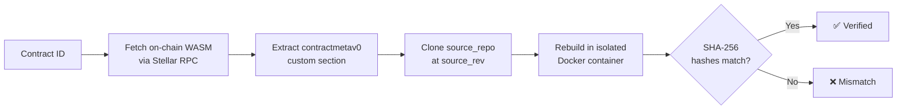

<div align="center">


# CSV Verify — Contract Source Verify

**Source verification for Soroban smart contracts on Stellar.**
CSV Verify rebuilds a contract from its public source code and proves the on-chain WASM matches — so users can trust what they interact with.

[**Live Demo**](https://stellar-contract-verification.vercel.app) · [Verify a Contract](https://stellar-contract-verification.vercel.app/verify) · [Developer Tutorial](https://stellar-contract-verification.vercel.app/for-devs/tutorial)


</div>

---

## Why CSV Verify?

On Stellar, anyone can deploy a Soroban contract — but users have no way to know **what code is actually running** behind a contract ID. A wallet, a DEX, or a lending protocol could be running something entirely different from the repository it advertises.

CSV Verify closes that gap using [SEP-58 (Contract Source Verification)](https://github.com/stellar/stellar-protocol/blob/master/ecosystem/sep-0058.md): developers embed build metadata into their WASM at compile time, and CSV Verify **independently rebuilds the contract from that exact source** and compares hashes. No trust required — the math either checks out or it doesn't.

## How Verification Works



1. **Fetch** — the deployed WASM is retrieved from the Stellar network via RPC.
2. **Extract** — the `contractmetav0` custom section is parsed for `source_repo`, `source_rev`, and optional `bldopt` build flags.
3. **Clone** — the public repository is cloned at the exact commit the developer pinned.
4. **Rebuild** — the contract is compiled inside an isolated Docker container, replaying the exact build flags.
5. **Compare** — the SHA-256 hash of the rebuilt WASM is compared against the on-chain hash. Match ⇒ verified.

### Verification Levels

| Level | Meaning |
|:-----:|---------|
| 0 | Unknown — no metadata found |
| 1 | Metadata Present — SEP-58 fields embedded, rebuild not confirmed |
| 2 | Source Verified — rebuilt WASM hash matches on-chain hash |
| 3 | Source + Attestation |
| 4 | Source + Attestation + Auditor |

## Features

- 🔍 **One-field verification** — paste a contract ID, get a full verification report (source repo, pinned commit, build image, build flags, hash match).
- ⚡ **Cache-first lookups** — previously verified contracts return instantly from the persisted store; fresh verifications run on demand.
- 🌐 **Bilingual UI (EN/ES)** — full English/Spanish toggle with zero dependencies; technical content and code always stay in English.
- 📚 **Step-by-step developer tutorial** — from `stellar contract build --meta` to a green "Verified" badge, including workspace/monorepo setups.
- 🤖 **CI-ready** — copy-paste GitHub Actions template that embeds SEP-58 metadata on every push.
- ♿ **Accessible & fast** — reduced-motion support, keyboard navigation, compressed media (18 MB hero video → <1 MB), no per-frame allocations in canvas animations.

## Architecture

The project is split across two components:

| Component | Stack | Where |
|-----------|-------|-------|
| **Frontend** (this branch) | Next.js 16 App Router · React 19 · TypeScript strict · Tailwind CSS v4 | Deployed on Vercel |
| **Backend verifier** | Rust · Axum · Docker builder · SQLite store · Stellar RPC client | [`demo-backend`](https://github.com/sebasberrios-dev/stellar-contract-verification/tree/demo-backend) branch, deployed on DigitalOcean |

The frontend never talks to the backend from the browser. All requests go through **Next.js API proxy routes**, keeping the backend URL server-side only:

| Route | Method | Purpose |
|-------|:------:|---------|
| `/api/verify` | `POST` | Submit a contract ID for verification (`{"contract_id": "C..."}`) |
| `/api/v1/contracts/{contract_id}/verifications?network=testnet` | `GET` | Look up persisted verifications for a contract |
| `/api/v1/wasm/{wasm_hash}/verifications` | `GET` | Look up verifications by WASM hash |

```bash
# Try it against the live deployment
curl -X POST https://stellar-contract-verification.vercel.app/api/verify \
  -H "Content-Type: application/json" \
  -d '{"contract_id": "YOUR_CONTRACT_ID"}'
```

## Getting Started

### Prerequisites

- **Node.js 20+**
- **pnpm** — this project uses pnpm exclusively (never npm/yarn) for supply-chain security. `pnpm-lock.yaml` is the single source of truth.

### Setup

```bash
git clone https://github.com/sebasberrios-dev/stellar-contract-verification.git
cd stellar-contract-verification
pnpm install

# Configure the backend URL (server-side only, never exposed to the client)
cp .env.example .env.local

pnpm dev
```

Open [http://localhost:3000](http://localhost:3000).

### Environment Variables

| Variable | Description | Example |
|----------|-------------|---------|
| `BACKEND_URL` | Rust verifier base URL (server-side only) | `http://localhost:8088` |
| `NEXT_PUBLIC_STELLAR_NETWORK` | Network badge shown in the UI | `TESTNET` |

> `.env.local` is gitignored. In production, `BACKEND_URL` is set as a Vercel environment variable — backend endpoints are never committed to the repository.

### Scripts

| Command | Action |
|---------|--------|
| `pnpm dev` | Start the dev server |
| `pnpm build` | Production build (type-checks with TypeScript strict) |
| `pnpm lint` | ESLint |
| `pnpm test` | Jest + Testing Library |

## Project Structure

```
src/
├── app/
│   ├── page.tsx              # Landing — hero video, how it works, FAQ
│   ├── verify/               # Verification page (form + result panel)
│   ├── for-devs/             # Developer hub + full SEP-58 tutorial
│   └── api/                  # Server-side proxy routes to the Rust backend
├── components/               # Navbar, HeroVideo, ResultPanel, CodeBlock, ...
├── i18n/                     # EN/ES dictionary, LanguageContext, token renderer
├── hooks/                    # useVerifyFlow — cache-first verification flow
├── lib/api.ts                # Backend client (server-side only)
└── types/                    # SEP-58 response schema types
```

## Verify Your Own Contract

The short version — build with SEP-58 metadata, deploy, paste the contract ID:

```bash
stellar contract build \
  --meta source_repo=https://github.com/your-org/your-contract \
  --meta source_rev=$(git rev-parse HEAD)

stellar contract deploy \
  --wasm target/wasm32v1-none/release/your_contract.wasm \
  --network testnet \
  --source YOUR_ACCOUNT
```

Then verify it at [csv-verify /verify](https://stellar-contract-verification.vercel.app/verify). The full walkthrough — including workspace/monorepo builds, `bldopt` rules, and troubleshooting — lives in [TUTORIAL.md](TUTORIAL.md) and the in-app [tutorial](https://stellar-contract-verification.vercel.app/for-devs/tutorial).

## Contributing

Work happens on feature branches with pull requests — direct pushes to `main` are not used. Keep TypeScript strict (no `any`), use pnpm only, and match the existing Tailwind token system (`globals.css` design tokens, no hardcoded colors).

## Community

- 𝕏 — [@MetaStellaX](https://x.com/MetaStellaX)
- Telegram — [CSV Verify community](https://t.me/+LkioKlyV7BhlN2Yx)

---

<div align="center">

**CSV Verify** — Contract Source Verify · Built for the Stellar ecosystem · Powered by Soroban

</div>
